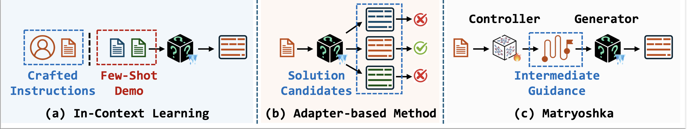
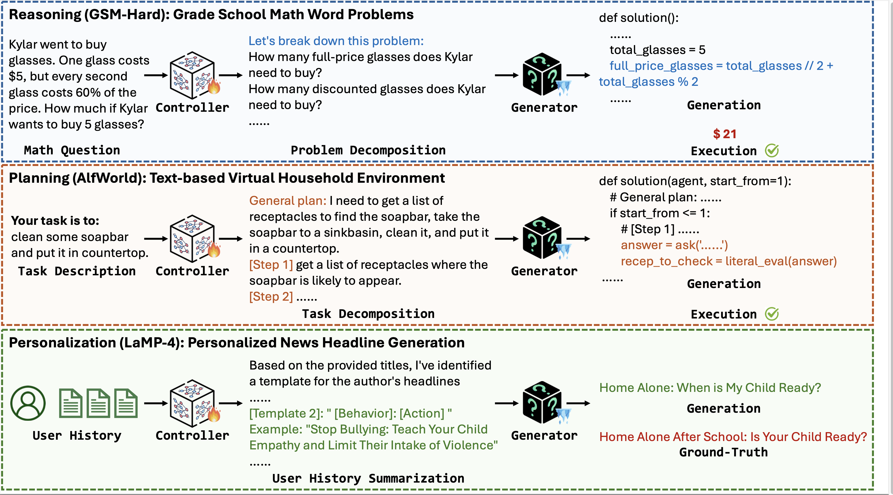

# Matryoshka

[arXiv] [Matryoshka: Learning to Drive Black-Box LLMs with LLMs](https://arxiv.org/abs/2410.20749)
[Website] [Matryoshka Project](https://lichangh20.github.io/Matryoshka-page/)

## Abstract

Despite the impressive generative abilities of black-box large language models (LLMs), their inherent opacity hinders further advancements in capabilities such as reasoning, planning, and personalization. 
Existing works aim to enhance LLM capabilities via domain-specific adaptation or in-context learning, which require additional training on accessible model parameters, an infeasible option for black-box LLMs. 
To address this challenge, we introduce Matryoshka, a lightweight white-box LLM controller that guides a large-scale black-box LLM generator by decomposing complex tasks into a series of intermediate outputs.
Specifically, we consider the black-box LLM as an environment, with Matryoshka serving as a policy to provide intermediate guidance through prompts for driving the black-box LLM. 
Matryoshka is trained to pivot the outputs of the black-box LLM aligning with preferences during iterative interaction, which enables controllable multi-turn generation and self-improvement in optimizing intermediate guidance. 
Empirical evaluations on three diverse tasks demonstrate that Matryoshka effectively enhances the capabilities of black-box LLMs in complex, long-horizon tasks, including reasoning, planning, and personalization. 
By leveraging this pioneering controller-generator framework to mitigate dependence on model parameters, Matryoshka provides a transparent and practical solution for improving black-box LLMs through controllable multi-turn generation using white-box LLMs. 

## Introduction

Existing research efforts for improving black-box LLM performance can be largely categorized into two main paradigms: 

- **In-context learning (ICL)-based methods** that are designed to guide LLM in exhibiting specific capabilities or adhering to particular directives. These frameworks necessitate meticulously constructing few-shot demonstrations or prompts for LLMs to emulate or follow, rather than fundamentally advancing their intrinsic capabilities. 
- **Adapter-based methods** that exploit the inherent randomness in LLM generation, producing multiple candidate outputs and subsequently selecting those that optimally satisfy domainpredetermined criteria. Nevertheless, these approaches are highly dependent on the intrinsic synthetic capabilities or built-in functionalities of the black-box LLM, potentially resulting in the selection of a suboptimal candidate when all the generated options are less than ideal.

We propose **Martryoshka**, a modular framework designed to enhance the advanced problem-solving capabilities of black-box LLMs via controllable multi-turn generations. 



A case study of **Martryoshka** on GSM8K, AlfWorld and LaMP is shown below. 



## Setups

You need to get an AzureOpenAI API key and store it in `models/credentials.py` and `pal/core/credentials.py`. In this project, we use `gpt3.5-turbo-0125` for `GPT3.5` .

## Package Installation

The required packages are listed as follows:

- accelerate==0.33.0
- bitsandbytes==0.43.3
- datasets==2.21.0
- deepspeed==0.14.4
- fastapi==0.112.2
- flash-attn==2.6.1
- numpy==1.26.4
- openai==1.43.0
- pandas==2.2.2
- peft==0.12.0
- pillow==10.4.0
- PyYAML==6.0.2
- safetensors==0.4.4
- scikit-learn==1.5.2
- tokenizers==0.19.1
- torch==2.4.0
- tqdm==4.66.5
- transformers==4.43.3
- vllm==0.6.1
- vllm-flash-attn==2.6.1
- wandb==0.17.8


You can install the required packages by running the following command:
`pip install -r requirements.txt`

## Experiments


The experiments are conducted on the following datasets: `gsm8k`, `alfworld`, and `LaMP`. The configurations for the experiments are stored in the `scripts` directory.

To run the experiments, you can follow the following instructions.

## Scirpts on Alfworld: Planning

Please refer to instruction [here](https://github.com/haotiansun14/AdaPlanner/tree/main) to prepare for Alfworld environment and data

#### Step 0. Use VLLM to start white-box model server

```bash
bash ./scripts/vllm.sh 8000 0
```

#### Step1. Sample Data On Training Set

```bash
python alfworld_generate_data.py \
    --disable_closeloop
```

>  Suppose generated data is saved at ./data/alfworld/gpt3.5/collect/train.jsonl

#### Step2. DPO Traning

```bash
set -x

read -r -d '' training_commands <<EOF
train_dpo \
   --save_path ./alfworld/llama3-8b-instruct-dpo-lora \
   --save_steps -1 \
   --logging_steps 1 \
   --eval_steps -1 \
   --train_batch_size 64 \
   --micro_train_batch_size 1 \
   --pretrain meta-llama/Meta-Llama-3-8B-Instruct \
   --bf16 \
   --max_epochs 1 \
   --max_len 8192 \
   --zero_stage 3 \
   --learning_rate 5e-6 \
   --beta 0.1 \
   --dataset json@./data/alfworld/gpt3.5/collect \
   --apply_chat_template \
   --chosen_key chosen \
   --rejected_key rejected \
   --load_checkpoint \
   --gradient_checkpointing \
   --label_smoothing 0.1 \
   --lora_rank 8 \
   --lora_alpha 16 \
   --lora_dropout 0.05
EOF

# --use_wandb

if [[ ${1} != "slurm" ]]; then
    deepspeed  --master_port=29400 --include localhost:0,1,2,3 --module $training_commands
fi

```

> Suppose DPO trained Lora model is saved at ./alfworld/llama3-8b-instruct-dpo-lora

#### Step3. Use trained Lora to do inference 

```bash
# open white-box vllm server
bash ./scripts/vllm_peft.sh 8000 0 meta-llama/Meta-Llama-3-8B-Instruct alfworld/llama3-8b-instruct-dpo-lora

# run inference using lora model
python alfworld_pipeline.py \
    --whitebox lora \
    --port 8000 \
    --use_gpt
```


## Scripts on GSM: Reasoning

#### Step0. Supervised Fine-tuning warmup & Start VLLM Server

We observe that `LLaMA3-8B-Instruct` demonstrates weak performance on Program-Aided Language models (PAL), so we conduct supervised fine-tuning using 200 samples as a warmup, with the corresponding script as follows:

```bash
set -x

read -r -d '' training_commands <<EOF
train_sft \
   --max_len 4096 \
   --dataset json@./data/gsm8k/pal_sft \
   --apply_chat_template \
   --input_key prompt \
   --output_key response \
   --train_batch_size 64 \
   --micro_train_batch_size 2 \
   --max_samples 500000 \
   --pretrain meta-llama/Meta-Llama-3-8B-Instruct \
   --save_path ./pal/llama3-8b-instruct-sft-lora-trainset \
   --save_steps -1 \
   --logging_steps 1 \
   --eval_steps -1 \
   --zero_stage 2 \
   --max_epochs 3 \
   --bf16 \
   --learning_rate 2e-5 \
   --load_checkpoint \
   --gradient_checkpointing \
   --ckpt_path ./pal/llama3-8b-instruct-sft-lora-trainset/checkpoints_sft \
   --lora_rank 8 \
   --lora_alpha 16 \
   --lora_dropout 0.05 \
   --max_ckpt_num 10
EOF

# --use_wandb

if [[ ${1} != "slurm" ]]; then
    deepspeed --master_port=29600 --include localhost:4,5,6,7 --module $training_commands
fi

```

Alternatively, you can also [download](https://drive.google.com/drive/folders/1oesgbSnKvMZG9tHIN4dptq2t8u28Yo6I?usp=sharing) the ckpt.

> Suppose SFT model is saved at ./pal/llama3-8b-instruct-sft-lora-trainset 


```bash
# open white-box vllm server
bash ./scripts/vllm_peft.sh 8000 0 meta-llama/Meta-Llama-3-8B-Instruct pal/llama3-8b-instruct-sft-lora-trainset 
```

#### Step1. Sample Data On Training Set

```bash
python gsm_generate_data.py \
        --whitebox lora \
        --port 8000
```

> Suppose generated data is saved at ./data/gsm/gpt3.5/collect/train.jsonl

#### Step2. DPO Training

```bash
set -x

read -r -d '' training_commands <<EOF
train_dpo \
   --save_path ./pal/llama3-8b-instruct-dpo-lora \
   --save_steps -1 \
   --logging_steps 1 \
   --eval_steps -1 \
   --train_batch_size 64 \
   --micro_train_batch_size 1 \
   --pretrain pal/llama3-8b-instruct-sft-lora-trainset/merged_model  \
   --bf16 \
   --max_epochs 1 \
   --max_len 8192 \
   --zero_stage 3 \
   --learning_rate 5e-6 \
   --beta 0.1 \
   --dataset json@./data/gsm/gpt3.5/collect \
   --apply_chat_template \
   --chosen_key chosen \
   --rejected_key rejected \
   --load_checkpoint \
   --gradient_checkpointing \
   --label_smoothing 0.1 \
   --lora_rank 8 \
   --lora_alpha 16 \
   --lora_dropout 0.05
EOF

# --use_wandb

if [[ ${1} != "slurm" ]]; then
    deepspeed  --master_port=29400 --include localhost:0,1,2,3 --module $training_commands
fi

```

> Suppose DPO trained Lora model is saved at ./pal/llama3-8b-instruct-dpo-lora

#### Step3. Use trained Lora to do inference 

```bash
# open white-box vllm server
bash ./scripts/vllm_peft.sh 8000 0 meta-llama/Meta-Llama-3-8B-Instruct pal/llama3-8b-instruct-dpo-lora

# run inference using lora model
# Inference on GSM8K
python gsm_pipeline.py \
    --port 8000 \
    --whitebox lora \
    --dataset gsm \
    --model gpt4o_mini \ # model can be [gpt-3.5-turbo, gpt4o_mini]
    --closeloop \
    --compare_answer
    
# Inference on GSM-Hard
python gsm_pipeline.py \
    --port 8000 \
    --whitebox lora \
    --dataset gsmhardv2 \
    --model gpt4o_mini \ # model can be [gpt-3.5-turbo, gpt4o_mini]
    --closeloop \
    --compare_answer
```

## Scripts on LaMP: Personalization
#### Step0. Prepare the data

```bash
python data/formalize_lamp.py
```

#### Step1. Start VLLM Server

```bash
bash ./scripts/vllm.sh 8000 0
```

#### Step2. Sample Data On Training Set

We take LaMP-1 as an example in the following steps, you can replace the task name in files.

```bash
python lamp_generate_data.py

# post-select the data and post-process the data
python data/post_select.py
python data/post_process.py
```

#### Step3. DPO Training

```bash
set -x

read -r -d '' training_commands <<EOF
train_dpo \
   --save_path ./lamp/llama3-8b-instruct-dpo-lora \
   --save_steps 1000 \
   --logging_steps 1 \
   --eval_steps -1 \
   --train_batch_size 2 \
   --gradient_accumulation_steps 4 \
   --micro_train_batch_size 1 \
   --pretrain meta-llama/Meta-Llama-3-8B-Instruct \
   --bf16 \
   --max_epochs 2 \
   --max_len 8192 \
   --zero_stage 3 \
   --learning_rate 1e-5 \
   --beta 0.1 \
   --dataset json@./data/lamp/processed/lamp1 \
   --apply_chat_template \
   --chosen_key chosen \
   --rejected_key rejected \
   --gradient_checkpointing \
   --label_smoothing 0.1 \
   --lora_rank 8 \
   --lora_alpha 16 \
   --lora_dropout 0.05 \
EOF

# --use_wandb
if [[ ${1} != "slurm" ]]; then
    deepspeed  --master_port=29400 --include localhost:0,1 --module $training_commands
fi
```

> Suppose DPO trained Lora model is saved at ./lamp/llama3-8b-instruct-dpo-lora

#### Step4. Use trained Lora to do inference 

```bash
# open white-box vllm server
bash ./scripts/vllm_peft.sh 8000 0 meta-llama/Meta-Llama-3-8B-Instruct lamp/llama3-8b-instruct-dpo-lora

# run inference using lora model
# Inference on LaMP-1
python lamp_pipeline.py \
    --port 8000 \
    --whitebox lora \
    --model gpt4o_mini \ # model can be [gpt-3.5-turbo, gpt4o_mini]
```

#### Step5. Evaluation
```bash
python metrics/eval.py
```

## Citation

If you find our work helpful, please consider citing our paper:

```
@article{li2024matryoshka,
  title={Matryoshka: Learning to Drive Black-Box LLMs with LLMs},
  author={Li, Changhao and Zhuang, Yuchen and Qiang, Rushi and Sun, Haotian and Dai, Hanjun and Zhang, Chao and Dai, Bo},
  journal={arXiv preprint arXiv:2410.20749},
  year={2024}
}
```

